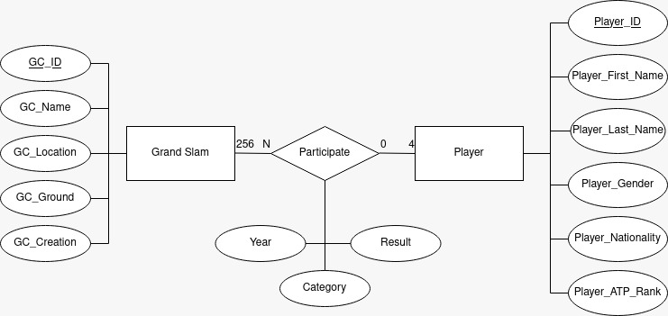

# Palmarès GC Tennis.


### Description du projet.

Les joueurs et joueuses de tennis professionnels doivent tout au long de l'année participer à des tournois afin de gagner des points ATP (Association of Tennis Professionals) qui permettent d'établir le classement et définir les meilleurs joueurs et joueuses du moment.
Parmi ces tournois se démarquent les Grand Chelem, qui sont les plus prestigieux mais aussi par conséquent, les plus concurrentiels. Ceux-ci permettent de remporter de nombreux points, et ainsi de gravir les marches du classement ATP, référence dans le tennis professionnel. Ces tournois du Grand Chelem sont au nombre de quatre, l'US Open, l'Open d'Australie, Wimbledon et Roland Garros.
Notre objectif dans ce projet, est de concevoir une base de données permettant d'obtenir le classement d'un joueur dans un grand chelem spécifique à une année spécifique.


### Participants.

- Massiles GHERNAOUT
- Julien FURET.
- Clément FLAMBARD.


### Modèle Entité / Association.



### Répartition des fichiers

``` Bash

    .
    ├── doc
    │   ├── P16_PalmaresGCTennis.pdf
    │   ├── shema-entites-associations.jpeg
    │   ├── shema-grand-slam.jpeg
    │   ├── shema-participate.jpeg
    │   └── shema-player.jpeg
    ├── README.md
    └── src
        ├── mysql
        │   ├── index.sql
        │   ├── Modals
        │   │   ├── P16_Grand_Slam.sql
        │   │   ├── P16_Participate.sql
        │   │   └── P16_Player.sql
        │   └── setup.sql
        └── postgresql
            ├── index.sql
            ├── Modals
            │   ├── P16_Grand_Slam.sql
            │   ├── P16_Participate.sql
            │   └── P16_Player.sql
            └── setup.sql

    6 directories, 16 files


```


### Configuration pour la contribution.

##### For mysql
```Bash

    # pour avoir le code source
    git clone <repo_url>
    cd  <repo_name>


    # pour creer ta branche
    git branch mysql
    # pour synchroniser avec github
    git push --set-upstream origin master

    # pour push les changement locaux
    git add *
    git commit -m "+mysql: your commit message"
    git push origin mysql

```


##### For postgresql
```Bash

    # pour avoir le code source
    git clone <repo_url>
    cd  <repo_name>


    # pour creer ta branche
    git branch postgresql
    # pour synchroniser avec github
    git push --set-upstream origin master

    # pour push les changement locaux
    git add *
    git commit -m "+postgresql: your commit message"
    git push origin postgresql
    
```
